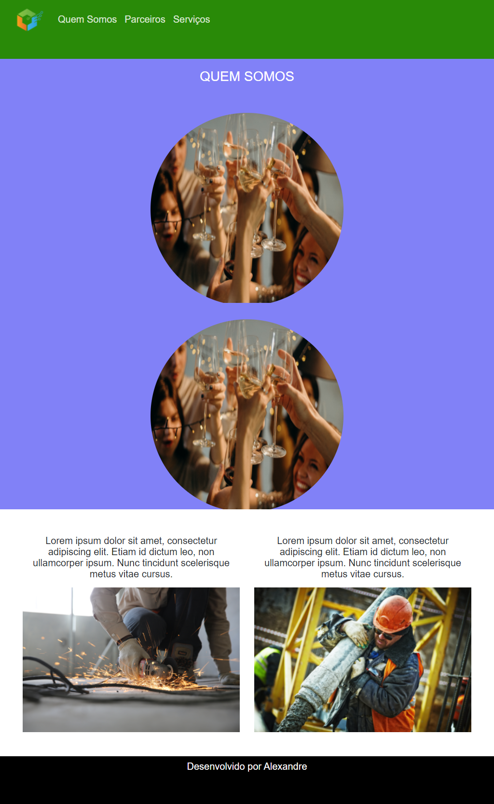

<h1 align="center">
    BootStrapDio
</h1>

  <a href="#open_book-sobre">Sobre</a>
  &nbsp;&nbsp;&nbsp;|&nbsp;&nbsp;&nbsp;
  <a href="#hammer-tecnologias">Tecnologias</a>

## :open_book: Sobre
Este repositório contêm um projeto de uma pagina feita no curso.

## :hammer: Tecnologias
Este projeto foi feito com as seguintes tecnologias:
- HTML
- CSS
- Bootstrap

## :rocket: Resultado

  

 

:computer: Curso de Bootstrap da: [Digital Innovation One](https://www.dio.me/)
